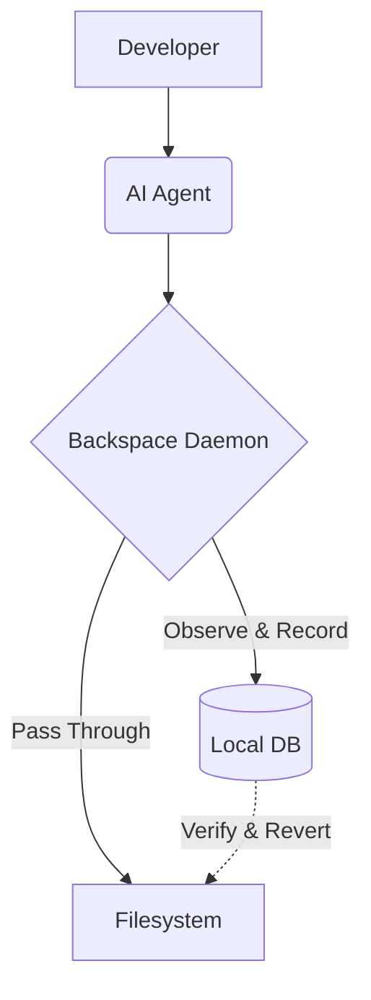

# Architecture Guide

Backspace is built as a zero-dependency, local-first engine. The entire system is designed around one core philosophy: **Observe, Record, and Revert deterministically.**

## High-Level Flow

## Packages

Backspace is a monorepo consisting of:

1. **`packages/cli`**: The core Node.js CLI and background daemon. This is the engine of the product.
2. **`apps/web`**: The Next.js marketing website.
3. **`packages/extension`**: (Upcoming) A native VS Code extension.

## Core Concepts

### 1. The Database (`db.ts`)
We use SQLite (`better-sqlite3`) in WAL (Write-Ahead Logging) mode. This is crucial because AI agents (like Claude Code or Cursor) often write to dozens of files in rapid succession. WAL mode ensures that the Backspace daemon can insert event rows concurrently without locking the database or missing a mutation.

### 2. The Supervisor (`supervisor.ts`)
When a user runs `backspace-ai watch`, the CLI does not block their terminal. Instead, it uses a Supervisor pattern. It forks a detached child process (the daemon) and exits immediately. The daemon runs in the background, communicating its health and session ID via environment variables (`BACKSPACE_SESSION_ID`) and PID files.

### 3. Event Provenance (`daemon.ts` & `events` table)
Instead of taking a single monolithic snapshot of a folder, Backspace records *individual events*. For every file added, modified, or deleted, a specific row is inserted into the `events` table with:
- `event_type`: add, change, or unlink
- `before_hash` / `after_hash`: for cryptographic verification
- `diff_payload`: surgical line-level differences

### 4. Zero-Knowledge Encryption (`crypto.ts`)
Security is paramount. The diff payloads and file contents are compressed (using Brotli) and then encrypted using AES-256-GCM before ever hitting the SQLite database. The encryption keys are kept strictly local.

### 5. The Revert Engine (`revert.ts`)
To rollback an AI session, the revert engine:
1. Queries all events for a specific session ID.
2. Orders them by `sequence` in reverse.
3. Applies inverse operations (e.g., if the AI *added* a file, the revert engine *deletes* it; if the AI *modified* a file, it applies a reverse patch).
4. Operations are atomic.

### 6. Model Context Protocol (MCP) (`mcp.ts`)
Backspace implements an MCP server, allowing supported AI tools to dynamically read their own session history and trigger safe rollbacks.
